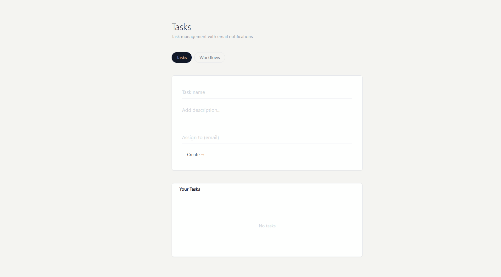
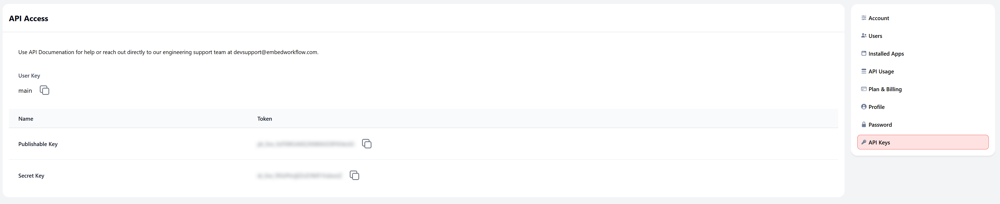
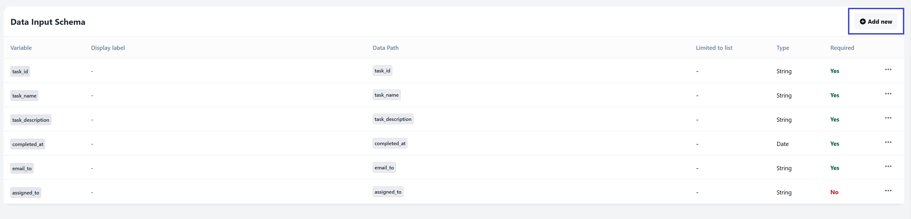

# Build Your Own Automation Platform: Todo App with Embedded Workflows

**Disclaimer**: Parts of this content have been generated with the use of AI.



See your workflows embedded directly in your application! This Todo app demonstrates how to integrate Embed Workflow for automated email and Slack notifications.

## Table of Contents

- [Build Your Own Automation Platform: Todo App with Embedded Workflows](#build-your-own-automation-platform-todo-app-with-embedded-workflows)
  - [Table of Contents](#table-of-contents)
  - [🚀 Quick Start](#-quick-start)
    - [1. Navigate to Project Directory](#1-navigate-to-project-directory)
    - [2. Install Dependencies](#2-install-dependencies)
    - [3. Set Up Embed Workflow](#3-set-up-embed-workflow)
    - [4. Run the Development Server](#4-run-the-development-server)
    - [5. Experience Your Embedded Automation Platform](#5-experience-your-embedded-automation-platform)
    - [6. You're Ready to Build!](#6-youre-ready-to-build)
  - [Configure Your Workflows](#configure-your-workflows)
    - [1. Create Triggers](#1-create-triggers)
      - [Task Created Trigger](#task-created-trigger)
      - [Task Completed Trigger](#task-completed-trigger)
    - [2. Create Workflows](#2-create-workflows)
  - [Using the Application](#using-the-application)
    - [Task Management](#task-management)
  - [Implementation Notes](#implementation-notes)
  - [Slack Configuration](#slack-configuration)
    - [1. Create Slack Bot Connection](#1-create-slack-bot-connection)
    - [2. Choose Your Slack Action](#2-choose-your-slack-action)
    - [3. Configure Send Message Action (for channels/groups)](#3-configure-send-message-action-for-channelsgroups)
    - [4. Configure Send Direct Message Action (for users)](#4-configure-send-direct-message-action-for-users)
    - [5. Variable Examples](#5-variable-examples)
    - [6. Rich Message Examples](#6-rich-message-examples)
  - [How it was implemented?](#how-it-was-implemented)
    - [Embedded Workflow Implementation](#embedded-workflow-implementation)
    - [Embed the Workflow Builder](#embed-the-workflow-builder)
    - [Implementation in Next.js](#implementation-in-nextjs)
    - [How Embedded Workflow Receives Variables](#how-embedded-workflow-receives-variables)

## 🚀 Quick Start

Follow these steps to see the embedded workflow builder in your app within minutes.

### 1. Navigate to Project Directory

```bash
cd beginner/todo-slack-notifications
# or on Windows
cd embed-workflow-demos\beginner\todo-slack-notifications
```

### 2. Install Dependencies

```bash
npm install
# or
yarn install
```

### 3. Set Up Embed Workflow

**Prerequisites:** You need an Embed Workflow account. [Sign up here](https://embedworkflow.com) if you don't have one.

Copy the `.env.template` to `.env.local` and add your keys:

```bash
cp .env.template .env.local
```

Then edit `.env.local` with your actual keys:

```bash
EMBED_WORKFLOW_SK=your_secret_key_here
EMBED_WORKFLOW_PK=your_publishable_key_here
NEXT_PUBLIC_EMBED_WORKFLOW_PK=your_publishable_key_here
EMBED_WORKFLOW_UI_VERSION=x.x.x
NEXT_PUBLIC_EMBED_WORKFLOW_UI_VERSION=x.x.x

# Optional: Set a default user for workflows (defaults to 'main')
# EMBED_WORKFLOW_DEFAULT_USER=main
```

**Note:** Check the latest UI version at https://embedworkflow.com/ui-version

**Get Your API Keys:**



1. Log into your [Embed Workflow account](https://embedworkflow.com/app)
2. Click the gear icon (⚙️) → API Keys  
3. Copy your Secret Key and Publishable Key
4. Update the `.env.local` file with your actual keys

**User-Specific Workflows:** Each user has their own set of workflows and automations. The app uses `EMBED_WORKFLOW_DEFAULT_USER` (defaults to 'main') to determine which user's workflows to load. This is important because:

- Each user can have different workflows
- Tasks and automations are isolated per user

Change the user by setting `EMBED_WORKFLOW_DEFAULT_USER` in your `.env.local` file.

### 4. Run the Development Server

```bash
npm run dev
# or
yarn dev
```

### 5. Experience Your Embedded Automation Platform

1. Open [http://localhost:3000](http://localhost:3000)
2. Click the **"Workflows"** tab

### 6. You're Ready to Build!

🎉 **This is it!** You've successfully embedded a complete automation platform into your Todo app. No redirects, no external tools - your users can now create workflows and powerful automations without ever leaving your application.

**What's Next?** Set up your triggers and create your first workflow in the section below.

---

## Configure Your Workflows

Now that you've seen the embedded builder, let's set up the triggers and workflows for the Todo app.

### 1. Create Triggers

In your Embed Workflow dashboard, navigate to the Triggers tab and create these triggers:


**Steps to Create a Trigger:**
1. Go to your Embed Workflow dashboard
2. Click on the "Triggers" tab
3. Click "New Trigger"
4. Configure the fields using the YAML configurations below
5. Click **"Publish Changes"** to make your triggers active

**Understanding Variable vs Data Path:**



- **Variable:** The name you'll use to reference this data in your workflow actions (e.g., `task_name`, `task_description`)
- **Data Path:** The actual path in the JSON data your application sends (e.g., `task_id`, `task_name`)

The Variable appears in your action configurations as `{{variable_name}}`, while the Data Path tells Embed Workflow where to find that data in your API payload.

#### Task Created Trigger

```yaml
event: "todo_list_item_created"
icon:
  type: "bolt"
  background_color: "slate"
groups: []
data_input_schema:
  - type: "String"
    required: true
    variable: "task_id"
    data_path: "task_id"
    display_label: "Task ID"
  - type: "String"
    required: true
    variable: "task_name"
    data_path: "task_name"
    display_label: "Task Name"
  - type: "String"
    required: true
    variable: "task_description"
    data_path: "task_description"
    display_label: "Task Description"
  - type: "Date"
    required: true
    variable: "created_at"
    data_path: "created_at"
    display_label: "Created At"
title: "Task Created"
description: "A task was created"
```

#### Task Completed Trigger

**Pro tip:** Duplicate the Task Created trigger and modify these fields:

```yaml
event: "todo_list_item_completed"
title: "Task Completed"
description: "A task was completed"
data_input_schema:
  # Same as Task Created, but replace "created_at" with:
  - type: "Date"
    required: true
    variable: "completed_at"
    data_path: "completed_at"
    display_label: "Completed At"
```

### 2. Create Workflows

Now you can build workflows directly in your embedded application! 

1. **Access the Workflow Builder**
   - In your Todo app, click the "Workflows" tab
   - Click "Open Workflow Builder" to access your embedded workflow builder

2. **Create Your First Workflow**
   - Click "New Workflow" in the embedded builder
   - Give it a descriptive name (e.g., "Send Email on Task Creation")
   - Select your Task Created trigger
   - Click the **+** sign below the trigger to add your first action
   - Choose an action (like Send Email) from the available options
   - Each action shows additional **+** signs where you can branch and add more actions
   - Build your workflow tree by adding actions in sequence or parallel branches
   - Make sure your workflow is **turned On** (check the toggle switch)
   - Click **"Publish Changes"** to save and activate your workflow

3. **Available Actions**
   Embed Workflow provides pre-built actions you can use immediately:
   - **Send Email** - Send automated emails
   - **Send Direct Message** - Send private Slack messages to users
   - **Send Message** - Send Slack messages to channels
   - **Ask ChatGPT** - Get AI responses and insights
   - **Trigger** - Start other workflows
   - **Condition** - Add conditional logic to workflows
   - **WaitUntil** - Wait for specific conditions
   - **Delay** - Add time delays between actions

4. **Example Email Workflow**
   When configuring the Send Email action, click the red **+** sign next to each field to add variables from your trigger:
   - **To:** `user@example.com` 
   - **Subject:** `New Task: {{task_name}}`
   - **Body:**
     ```
     A new task has been created:
     
     Task: {{task_name}}
     Description: {{task_description}}
     Created: {{created_at}}
     
     Best regards,
     Todo App Team
     ```

For detailed Slack configuration, see the [Slack Setup](#slack-configuration) section below.

---

## Using the Application

### Task Management

1. **Create Tasks** - Add task name and description
2. **Complete Tasks** - Click to toggle completion status
3. **Automatic Notifications** - Workflows trigger on task events

## Implementation Notes

- Tasks stored in local text file
- Real-time API communication with Embed Workflow
- Automatic trigger activation on task events

## Slack Configuration

Slack notifications require additional setup beyond the basic workflow configuration. This section covers the necessary steps to integrate Slack messaging into your workflows.

### 1. Create Slack Bot Connection

Before using the "Send Message" action, you need to create a Slack connection:

1. **Create New Connection**  
   When configuring the "Send Message" action, click "Create a new connection"

2. **Set Connection Name**  
   Give your connection a descriptive name like "Bot Token" or "My Slack Bot"

3. **Configure Bot Token**  
   Enter your Slack Bot Token (starts with `xoxb-`)

### 2. Choose Your Slack Action

Embed Workflow provides two Slack messaging options that automatically load all available users, channels, and groups from your workspace:

- **Send Message** - Send messages to channels or groups
- **Send Direct Message** - Send private messages directly to users

### 3. Configure Send Message Action (for channels/groups)

Once your Slack connection is set up, configure the Send Message action with these fields:

**Connection Name:** Bot Token (or your chosen connection name)

**Channel:** `demo`
- Select a specific channel to send the message to
- Examples: `#general`, `#notifications`, `demo`

**Message (for task assignment to team channel):** 
```
👥 Team Update!

📋 New task has been assigned:

Task: {{task_name}}
Description: {{task_description}}
Assigned to: {{assigned_to}}

📅 Created: {{created_at}}
⏳ Status: Pending

{{assigned_to}} - please check your task list when you're ready!

Team - feel free to offer support if needed. Let's help each other succeed! 💪

---
🤖 Automated from Todo App Workflow
```

**Blocks JSON (for task assignment):**
```json
[
  {
    "type": "header",
    "text": {
      "type": "plain_text",
      "text": "📋 Task Assigned"
    }
  },
  {
    "type": "section",
    "text": {
      "type": "mrkdwn",
      "text": ":point_right: *New task assigned to {{assigned_to}}!*\n\n*Task:* {{task_name}}\n*Description:* {{task_description}}"
    }
  },
  {
    "type": "section",
    "fields": [
      {
        "type": "mrkdwn",
        "text": "*Assigned to:*\n:bust_in_silhouette: {{assigned_to}}"
      },
      {
        "type": "mrkdwn",
        "text": "*Status:*\n:hourglass_flowing_sand: Pending"
      },
      {
        "type": "mrkdwn",
        "text": "*Created:*\n:calendar: {{created_at}}"
      },
      {
        "type": "mrkdwn",
        "text": "*Priority:*\n:large_orange_diamond: Normal"
      }
    ]
  },
  {
    "type": "section",
    "text": {
      "type": "mrkdwn",
      "text": ":memo: {{assigned_to}} - please check your task list when ready!\n:handshake: Team - feel free to offer support if needed!"
    }
  },
  {
    "type": "actions",
    "elements": [
      {
        "type": "button",
        "text": {
          "type": "plain_text",
          "text": "View All Tasks"
        },
        "style": "primary",
        "url": "http://localhost:3000"
      }
    ]
  },
  {
    "type": "context",
    "elements": [
      {
        "type": "mrkdwn",
        "text": ":robot_face: Automated from Todo App Workflow"
      }
    ]
  }
]
```

**Message (for task completion):** 
```
Hi there! 

A task has been completed:

Task: {{task_name}}
Description: {{task_description}}
Completed by: {{assigned_to}}

🎉 Great job!
```

**Blocks JSON (for task completion):**
```json
[
  {
    "type": "header",
    "text": {
      "type": "plain_text",
      "text": "✅ Task Completed"
    }
  },
  {
    "type": "section",
    "text": {
      "type": "mrkdwn",
      "text": ":white_check_mark: *Task Completed!*\n\n*Task:* {{task_name}}\n*Description:* {{task_description}}\n*Completed by:* {{assigned_to}}"
    }
  },
  {
    "type": "section",
    "fields": [
      {
        "type": "mrkdwn",
        "text": "*Status:*\n:white_check_mark: Completed"
      },
      {
        "type": "mrkdwn",
        "text": "*Completed:*\n{{completed_at}}"
      }
    ]
  },
  {
    "type": "section",
    "text": {
      "type": "mrkdwn",
      "text": ":tada: Great job completing this task!"
    }
  },
  {
    "type": "context",
    "elements": [
      {
        "type": "mrkdwn",
        "text": ":robot_face: Sent from Todo App Workflow"
      }
    ]
  }
]
```

**Action Name:** Send Message

**Response Prefix (optional):** Leave empty or use `slack_response`

### 4. Configure Send Direct Message Action (for users)

Use this action to send private messages directly to users:

**Connection Name:** Bot Token (or your chosen connection name)

**User:** Select from available users
- Choose a specific user from the dropdown list

**Message (for personal task assignment):**
```
Hi there! 👋

You have a new task:

📝 Task: {{task_name}}
📄 Description: {{task_description}}

📅 Created: {{created_at}}
⏳ Status: Pending

Please review and start working on this when you're ready. Thanks!

Best regards,
Todo App Team
```

**Blocks JSON (optional):**
```json
[
  {
    "type": "section",
    "text": {
      "type": "mrkdwn",
      "text": "Hi there! :wave:\n\nYou have a new task assigned to you:"
    }
  },
  {
    "type": "section",
    "fields": [
      {
        "type": "mrkdwn",
        "text": "*Task:*\n{{task_name}}"
      },
      {
        "type": "mrkdwn", 
        "text": "*Description:*\n{{task_description}}"
      }
    ]
  }
]
```

**Action Name:** Send Direct Message

**Response Prefix (optional):** Leave empty or use `dm_response`

### 5. Variable Examples

You can use these variables from your trigger data in any field:

- `{{task_name}}` - The name of the task
- `{{task_description}}` - Task description
- `{{assigned_to}}` - Who the task is assigned to
- `{{completed_at}}` - When the task was completed
- `{{created_at}}` - When the task was created

### 6. Rich Message Examples

**Simple Notification:**
```
🚨 New task created: {{task_name}}
Assigned to: {{assigned_to}}
```

**Completion Celebration:**
```
🎉 Task completed!

✅ {{task_name}}
👤 Completed by: {{assigned_to}}
📅 {{completed_at}}

Keep up the great work! 🚀
```

**Detailed Update:**
```
📋 **Task Update**

**Name:** {{task_name}}
**Description:** {{task_description}}
**Status:** Completed ✅
**Assignee:** {{assigned_to}}
**Completion Date:** {{completed_at}}

---
*Sent from Todo App Workflow*
```

## How it was implemented?

### Embedded Workflow Implementation

The embedded workflow builder is implemented in `/pages/workflows/[id].js`. Here are the key code blocks:

### Embed the Workflow Builder

For complete documentation on embedding and authentication, see: [Embed Workflow Quick Start Guide](https://docs.embedworkflow.com/getting-started/quick-start)

First, add the following script tag to your HTML:

```html
<!-- Load CSS / JS -->
<!-- Check latest version at: https://embedworkflow.com/ui-version -->
<link rel="stylesheet" media="screen" href="https://cdn.ewf.to/ewf-REPLACE_ME_WITH_LATEST_UI_VERSION.css">
<script src="https://cdn.ewf.to/ewf-REPLACE_ME_WITH_LATEST_UI_VERSION.js"></script>

<!-- Mounted App -->
<div class="EWF__app" data-base-path="workflows"></div>

<script type="text/javascript">
  EWF.load("REPLACE_ME_WITH_YOUR_PK", { jwt: "REPLACE_ME_WITH_YOUR_JWT" });

  // For testing purposes, you can use a temporary user token instead of a JWT.
  // Note: This token will expire - you'll need to refresh the page and update the token when it does.
  // EWF.load("REPLACE_ME_WITH_YOUR_PK", { userToken: "YOUR_TEMPORARY_USER_TOKEN_HERE" });
</script>
```

### Implementation in Next.js

In the actual Next.js implementation, the version is loaded dynamically from environment variables:

**1. Loading the Embed Workflow UI:**
```jsx
// Version comes from NEXT_PUBLIC_EMBED_WORKFLOW_UI_VERSION in .env.local
const version = process.env.NEXT_PUBLIC_EMBED_WORKFLOW_UI_VERSION || '1.5.0';

const script = document.createElement("script");
script.src = `https://cdn.ewf.to/ewf-${version}.js`;

script.onload = () => {
  loadWorkflows();
};
```

**2. Embedding Container:**
```jsx
<div
  className="EWF__app"
  data-base-path="workflows"
></div>
```

**3. Initialization:**
```jsx
const loadWorkflows = () => window.EWF.load(embedWorkflowPk, { 
  jwt: token
});
```

**4. JWT Token Generation:**
```jsx
const payload = {
  sub: id, // user's unique identifier
  iat: currentTime,
  exp: currentTime + 60 * 60,
  discover: true
};
const token = JWT.sign(payload, secret, { algorithm: "HS256" });
```

### How Embedded Workflow Receives Variables

When your application triggers a workflow, it sends data to Embed Workflow through API calls. Here's how the variables flow from your app to your workflows:

**1. Trigger API Call:**
Your application sends a POST request to trigger workflows:
```javascript
const response = await fetch('/api/trigger-workflow', {
  method: 'POST',
  headers: { 'Content-Type': 'application/json' },
  body: JSON.stringify({
    event: 'todo_list_item_created',
    data: {
      task_id: '12345',
      task_name: 'Complete project documentation',
      task_description: 'Write comprehensive docs for the new feature',
      created_at: new Date().toISOString()
    }
  })
});
```

**2. Server-side Processing:**
The `/pages/api/trigger-workflow.js` endpoint forwards this data to Embed Workflow:
```javascript
const payload = {
  event: eventName,
  execution_data: eventData,
  user_key: 'main'  // or the specific user key
};

const response = await fetch('https://embedworkflow.com/api/v1/trigger', {
  method: 'POST',
  headers: {
    'Authorization': `Bearer ${process.env.EMBED_WORKFLOW_SK}`,
    'Content-Type': 'application/json'
  },
  body: JSON.stringify(payload)
});
```

**3. Variable Mapping:**
Embed Workflow maps the incoming data to your trigger's schema:
- `data.task_id` → `{{task_id}}` variable
- `data.task_name` → `{{task_name}}` variable  
- `data.task_description` → `{{task_description}}` variable
- `data.created_at` → `{{created_at}}` variable

**4. Using Variables in Actions:**
These variables become available in your workflow actions:
```
Subject: New Task: {{task_name}}
Body: Task "{{task_description}}" was created on {{created_at}}
```
