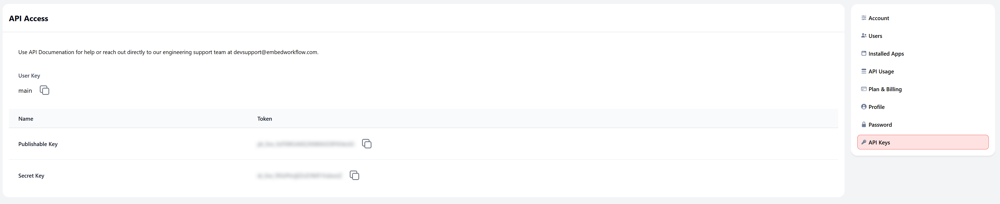
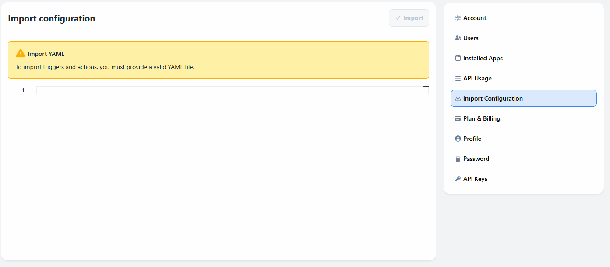
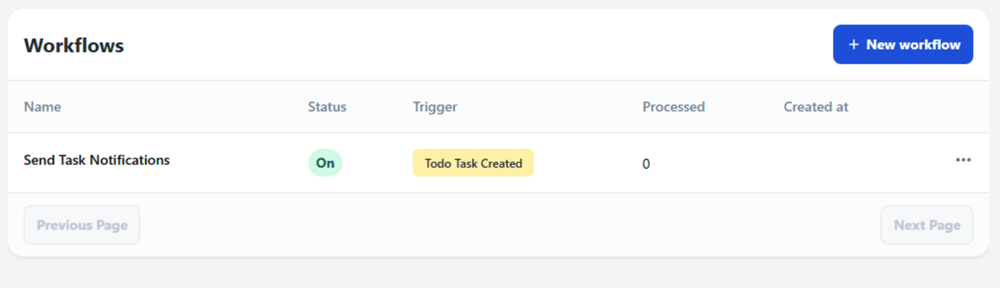
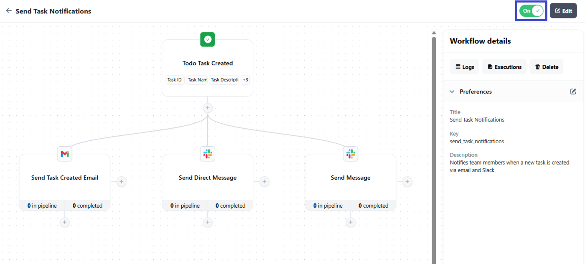

# Build Your Own Automation Platform: Todo App with Embedded Workflows

**Disclaimer**: Parts of this content have been generated with the use of AI.


See your workflows embedded directly in your application! This Todo app demonstrates how to integrate Embed Workflow for automated email and Slack notifications.

## Table of Contents

- [Build Your Own Automation Platform: Todo App with Embedded Workflows](#build-your-own-automation-platform-todo-app-with-embedded-workflows)
  - [Table of Contents](#table-of-contents)
  - [🚀 Quick Start](#-quick-start)
    - [1. Navigate to Project Directory](#1-navigate-to-project-directory)
    - [2. Install Dependencies](#2-install-dependencies)
    - [3. Set Up Embed Workflow](#3-set-up-embed-workflow)
    - [4. Run the Development Server](#4-run-the-development-server)
    - [5. Experience Your Embedded Automation Platform](#5-experience-your-embedded-automation-platform)
    - [6. You're Ready to Build!](#6-youre-ready-to-build)
  - [Import Your Workflow](#import-your-workflow)
  - [Using the Application](#using-the-application)
    - [Task Management](#task-management)
  - [Implementation Notes](#implementation-notes)
  - [How it was implemented?](#how-it-was-implemented)
    - [Embedded Workflow Implementation](#embedded-workflow-implementation)
    - [Embed the Workflow Builder](#embed-the-workflow-builder)
    - [Implementation in Next.js](#implementation-in-nextjs)
    - [How Embedded Workflow Receives Variables](#how-embedded-workflow-receives-variables)

## 🚀 Quick Start

Follow these steps to see the embedded workflow builder in your app within minutes.

### 1. Navigate to Project Directory

```bash
cd beginner/todo-slack-notifications
# or on Windows
cd embed-workflow-demos\beginner\todo-slack-notifications
```

### 2. Install Dependencies

```bash
npm install
# or
yarn install
```

### 3. Set Up Embed Workflow

**Prerequisites:** You need an Embed Workflow account. [Sign up here](https://embedworkflow.com) if you don't have one.

Copy the `.env.template` to `.env.local` and add your keys:

```bash
cp .env.template .env.local
```

Then edit `.env.local` with your actual keys:

```bash
EMBED_WORKFLOW_SK=your_secret_key_here
EMBED_WORKFLOW_PK=your_publishable_key_here
NEXT_PUBLIC_EMBED_WORKFLOW_PK=your_publishable_key_here
EMBED_WORKFLOW_UI_VERSION=x.x.x
NEXT_PUBLIC_EMBED_WORKFLOW_UI_VERSION=x.x.x

# Optional: Set a default user for workflows (defaults to 'main')
# EMBED_WORKFLOW_DEFAULT_USER=main
```

**Note:** Check the latest UI version at https://embedworkflow.com/ui-version

**Get Your API Keys:**



1. Log into your [Embed Workflow account](https://embedworkflow.com/app)
2. Click the gear icon (⚙️) → API Keys  
3. Copy your Secret Key and Publishable Key
4. Update the `.env.local` file with your actual keys

**User-Specific Workflows:** Each user has their own set of workflows and automations. The app uses `EMBED_WORKFLOW_DEFAULT_USER` (defaults to 'main') to determine which user's workflows to load. This is important because:

- Each user can have different workflows
- Tasks and automations are isolated per user

Change the user by setting `EMBED_WORKFLOW_DEFAULT_USER` in your `.env.local` file.

### 4. Run the Development Server

```bash
npm run dev
# or
yarn dev
```

### 5. Experience Your Embedded Automation Platform

1. Open [http://localhost:3000](http://localhost:3000)
2. Click the **"Workflows"** tab

### 6. You're Ready to Build!

🎉 **This is it!** You've successfully embedded a complete automation platform into your Todo app. No redirects, no external tools - your users can now create workflows and powerful automations without ever leaving your application.

**What's Next?** Simply import the workflow below to get started!

## Import Your Workflow

Import the workflow configuration to create your trigger, actions, and workflow structure. You must configure each action with your connections and settings after import:

**Task Notification Recipe:**

Copy the recipe below:

```yaml
# Task Notification Recipe
# Sends notifications when a new todo task is created

# Apps used for notifications
apps:
  - gmail
  - slack

# Trigger for new task creation
triggers:
  - title: "Todo Task Created"
    description: "Triggered when a new todo list item is created"
    event: "todo_list_item_created"
    icon:
      type: "check-circle"
      background_color: "green"
    groups: []
    data_input_schema:
      - type: "String"
        required: true
        variable: "task_id"
        data_path: "task_id"
        display_label: "Task ID"
      - type: "String"
        required: true
        variable: "task_name"
        data_path: "task_name"
        display_label: "Task Name"
      - type: "String"
        required: false
        variable: "task_description"
        data_path: "task_description"
        display_label: "Task Description"
      - type: "Date"
        required: true
        variable: "created_at"
        data_path: "created_at"
        display_label: "Created At"
      - type: "String"
        required: true
        variable: "email_to"
        data_path: "email_to"
        display_label: "Email To"
      - type: "String"
        required: true
        variable: "assigned_to"
        data_path: "assigned_to"
        display_label: "Assigned To"

# Workflow definition
workflows:
  - name: "Send Task Notifications"
    description: "Notifies team members when a new task is created via email and Slack"
    categories:
      - Task Management
    image_url: "https://cms.embedworkflow.com/wp-content/uploads/2025/07/20250726162344_task_notification_recipe_image.png"
    summary: |
      ## Task Notification Workflow

      This workflow sends multi-channel notifications when a new task is created in the todo system.

      ### Steps (Parallel Execution):
      1. **Trigger**: New todo task is created
      2. **Email Notification**: Sends task details to assignee via Gmail
      3. **Slack DM**: Sends direct message to specific user
      4. **Slack Channel**: Posts task announcement to #demo channel

      ### Key Features:
      - Parallel execution for instant notifications
      - Multi-channel communication (Email + Slack)
      - Rich formatting with emojis in Slack messages
      - Ensures no task goes unnoticed
    trigger:
      event: "todo_list_item_created"
      match_conditions: "all"
      conditions: []

    # No edges because all nodes run independently (parallel execution)
    edges: []

    nodes:
      - id: "67a409"
        name: "Send Task Created Email"
        type: "CustomApiRequest"
        action_type_id: "{{ apps.gmail.send_email }}"
        prefix: ""
        action_data:
          form__gmail_to: "{{ email_to }}"
          form__gmail_subject: "New Task Created: {{ task_name }}"
          form__gmail_body: |
            Hi! A new task has been assigned to you: 
            
            Task: {{ task_name }} 
            Description: {{ task_description }} 
            
            Best regards,
            Todo App Team
          form__gmail_cc: ""
          form__gmail_bcc: ""

      - id: "06f0b8"
        name: "Send Direct Message"
        type: "CustomApiRequest"
        action_type_id: "{{ apps.slack.send_direct_message }}"
        prefix: ""
        action_data:
          form__slack_dm_text: |
            Hi {{ assigned_to }}! 👋

            You have a new task assigned:

            Task: {{ task_name }}
            Description: {{ task_description }}

            Please check your todo list when you have a moment.

            Best regards,
            Todo App Team
          form__slack_dm_blocks: ""

      - id: "b6aa0f"
        name: "Send Message"
        type: "CustomApiRequest"
        action_type_id: "{{ apps.slack.send_message }}"
        prefix: ""
        action_data:
          form__slack_message_text: |
            🔔 Task Assignment Alert

              📋 {{ task_name }}
              👤 Assigned to: {{ assigned_to }}
              📅 {{ created_at }}

              {{ assigned_to }} - you've got this! 💪
              Team - let's support each other! 🤝
          form__slack_blocks: ""
```

**Import Steps:**



1. **Access Configuration Settings**  
   Click the gear icon (⚙️) in your workflow dashboard

2. **Open Import Configuration**  
   Click **Import Configuration** from the settings menu

3. **Import Workflow**  
   Paste the YAML configuration above → Click **Import**
   
   > **Note:** If you receive an "app already installed" error, remove the `apps:` section from the YAML (lines with `- gmail` and `- slack`). This error occurs when these apps exist in your account.

4. **Verify Import**  
   Navigate to the **Workflows** tab to see your imported workflow
   
   

   > **Important:** The import creates your workflow structure. You'll need to configure connections and activate the workflow to make it functional.

5. **Configure Your Service Connections**
   
   Update the imported workflow actions with your actual service connections:

   **Slack Connection:**
   - Click on any Slack action in your workflow
   - Add your Slack Bot Token (get from [Slack API](https://api.slack.com/apps))

   **Gmail Connection:**
   - Click on the Gmail action
   - Follow the OAuth flow to connect your email account

   For detailed connection setup instructions, check the [Embed Workflow Documentation](https://docs.embedworkflow.com/)

6. **Activate Workflow**  
   Toggle "On" → Click **Publish Changes**
   
   

---

## Using the Application

### Task Management

1. **Create Tasks** - Add task name and description
2. **Complete Tasks** - Click to toggle completion status  
3. **Automatic Notifications** - Workflows trigger on task events

## Implementation Notes

- Tasks stored in local text file
- Real-time API communication with Embed Workflow
- Automatic trigger activation on task events


## How it was implemented?

### Embedded Workflow Implementation

The embedded workflow builder is implemented in `/pages/workflows/[id].js`. Here are the key code blocks:

### Embed the Workflow Builder

For complete documentation on embedding and authentication, see: [Embed Workflow Quick Start Guide](https://docs.embedworkflow.com/getting-started/quick-start)

First, add the following script tag to your HTML:

```html
<!-- Load CSS / JS -->
<!-- Check latest version at: https://embedworkflow.com/ui-version -->
<link rel="stylesheet" media="screen" href="https://cdn.ewf.to/ewf-REPLACE_ME_WITH_LATEST_UI_VERSION.css">
<script src="https://cdn.ewf.to/ewf-REPLACE_ME_WITH_LATEST_UI_VERSION.js"></script>

<!-- Mounted App -->
<div class="EWF__app" data-base-path="workflows"></div>

<script type="text/javascript">
  EWF.load("REPLACE_ME_WITH_YOUR_PK", { jwt: "REPLACE_ME_WITH_YOUR_JWT" });

  // For testing purposes, you can use a temporary user token instead of a JWT.
  // Note: This token will expire - you'll need to refresh the page and update the token when it does.
  // EWF.load("REPLACE_ME_WITH_YOUR_PK", { userToken: "YOUR_TEMPORARY_USER_TOKEN_HERE" });
</script>
```

### Implementation in Next.js

In the actual Next.js implementation, the version is loaded dynamically from environment variables:

**1. Loading the Embed Workflow UI:**
```jsx
// Version comes from NEXT_PUBLIC_EMBED_WORKFLOW_UI_VERSION in .env.local
const version = process.env.NEXT_PUBLIC_EMBED_WORKFLOW_UI_VERSION || '1.5.0';

const script = document.createElement("script");
script.src = `https://cdn.ewf.to/ewf-${version}.js`;

script.onload = () => {
  loadWorkflows();
};
```

**2. Embedding Container:**
```jsx
<div
  className="EWF__app"
  data-base-path="workflows"
></div>
```

**3. Initialization:**
```jsx
const loadWorkflows = () => window.EWF.load(embedWorkflowPk, { 
  jwt: token
});
```

**4. JWT Token Generation:**
```jsx
const payload = {
  sub: id, // user's unique identifier
  iat: currentTime,
  exp: currentTime + 60 * 60,
  discover: true
};
const token = JWT.sign(payload, secret, { algorithm: "HS256" });
```

### How Embedded Workflow Receives Variables

When your application triggers a workflow, it sends data to Embed Workflow through API calls. Here's how the variables flow from your app to your workflows:

**1. Trigger API Call:**
Your application sends a POST request to trigger workflows:
```javascript
const response = await fetch('/api/trigger-workflow', {
  method: 'POST',
  headers: { 'Content-Type': 'application/json' },
  body: JSON.stringify({
    event: 'todo_list_item_created',
    data: {
      task_id: '12345',
      task_name: 'Complete project documentation',
      task_description: 'Write comprehensive docs for the new feature',
      created_at: new Date().toISOString()
    }
  })
});
```

**2. Server-side Processing:**
The `/pages/api/trigger-workflow.js` endpoint forwards this data to Embed Workflow:
```javascript
const payload = {
  event: eventName,
  execution_data: eventData,
  user_key: 'main'  // or the specific user key
};

const response = await fetch('https://embedworkflow.com/api/v1/trigger', {
  method: 'POST',
  headers: {
    'Authorization': `Bearer ${process.env.EMBED_WORKFLOW_SK}`,
    'Content-Type': 'application/json'
  },
  body: JSON.stringify(payload)
});
```

**3. Variable Mapping:**
Embed Workflow maps the incoming data to your trigger's schema:
- `data.task_id` → `{{task_id}}` variable
- `data.task_name` → `{{task_name}}` variable  
- `data.task_description` → `{{task_description}}` variable
- `data.created_at` → `{{created_at}}` variable
- `data.email_to` → `{{email_to}}` variable
- `data.assigned_to` → `{{assigned_to}}` variable

**4. Using Variables in Actions:**
These variables become available in your workflow actions:
```
Subject: New Task: {{task_name}}
Body: Task "{{task_description}}" was created on {{created_at}}
```
