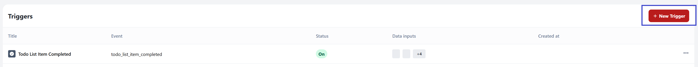

# Todo App With Embed Workflow Integration


This Todo application integrates with Embed Workflow to send email or Slack notifications when you create or complete tasks.

## Features

- Create and manage tasks
- Mark tasks as complete
- Send email or Slack notifications when you create or complete tasks
- Integrate with Embed Workflow for automation
- Access embedded Workflow UI for workflow management

## Setup Instructions

### 1. Navigate to Project Directory

If you have the whole repository open locally, navigate to this project's directory:

```bash
cd beginner/todo-slack-notifications
# or on Windows
cd embed-workflow-demos\beginner\todo-slack-notifications
```

### 2. Install Dependencies

```bash
npm install
# or
yarn install
```

### 3. Configure Embed Workflow

Set up the following in your Embed Workflow account:

1. **Create Task Created Trigger**  
   
   Go to your Embed Workflow dashboard and navigate to the Triggers tab. Click "New Trigger" and configure these fields:
   - Name: "Task Created"
   - Data Schema:
   
     - task_id (String)
     - task_name (String)
     - task_description (String)
     - created_at (Date)
     - email_list (Array)

   **Understanding Variable vs Data Path:**
   When configuring the Data Input Schema for your trigger:
   - **Variable:** The name you'll use to reference this data in your workflow actions (e.g., `task_name`, `email_to`)
   - **Data Path:** The actual path in the JSON data your application sends (e.g., `data.task.name`, `data.assignee.email`)
   
   The Variable is what appears in your action configurations as `{{variable_name}}`, while the Data Path tells Embed Workflow where to find that data in your API payload.

2. **Create Task Completed Trigger**  
   Follow the same process as the Task Created trigger but name it "Task Completed" and add the field "completed_at" (Date) instead of "created_at".

3. **Create Workflows**  
   Go to the Workflows tab and create workflows that connect the triggers to the pre-made actions. Embed Workflow provides built-in "Send Email" and "Send Message" (for Slack) actions that you can use without creating custom actions.

   **Set Up Your Workflow:**
   1. Click "New Workflow"
   2. Give your workflow a descriptive title
   3. Click on the trigger balloon (circle icon)
   4. Select the "Task Created" trigger you created in step 1
   5. Click the **+** sign that appears under the trigger balloon
   6. Select the "Send Email" action
   7. Click on the "Send Email" action to configure it

   **Set Up Email Connection:**
   When you click on the Send Email action, you'll need to create an email connection:
   1. Click "Create a new connection"
   2. Select the email service you want to use for automation
   3. Click "Continue"
   4. Give your connection a descriptive name
   5. Click "Save"

   **Configure the Send Email Action:**
   When setting up the Send Email action, you can use variables from your trigger schema by clicking the **+** sign next to each field. This will reference the variable names defined in your trigger's Data Schema section.

   Example configuration for task completion emails:
   - **Title:** Send Task Completion Email
   - **Key:** send_task_completion_email
   - **From:** (leave empty to use default Gmail address)
   - **To:** `{{email_to}}` (references the email variable from your trigger)
   - **Subject:** `{{task_name}}` (uses the task name from the trigger data)
   - **Email Body:**
     ```
     Hi there,
     
     A task assigned to you has been completed:
     
     Task: {{task_name}}
     Description: {{task_description}}
     
     Best regards,
     Todo App Team
     ```

   **Set Up Slack Notifications (Optional):**
   If you want to send Slack notifications instead of or in addition to email, follow the same workflow creation process but select "Send Message" action instead of "Send Email". For detailed Slack setup instructions, see the [Slack Configuration](#slack-configuration) section below.

### 4. Set Environment Variables

Create a `.env.local` file in the root directory with your Embed Workflow credentials:

```bash
EMBED_WORKFLOW_SK=your_secret_key
EMBED_WORKFLOW_PK=your_publishable_key
EMBED_WORKFLOW_UI_VERSION=1.43.0
```

**Get Your API Keys:**


1. **Log In to Your Account**  
   Access your Embed Workflow account.

2. **Access Account Settings**  
   Click the gear icon (⚙️) in the top navigation.

3. **Navigate to API Keys**  
   Click the "API Keys" tab.

4. **Locate Your Keys**  
   Find these keys:
   - **Secret Key** (EMBED_WORKFLOW_SK) - Server-side API calls
   - **Publishable Key** (EMBED_WORKFLOW_PK) - Client-side integration
   - **User Key** - Your unique user identifier

**Security Notes:**

- Keep your Secret Key secure and never expose it in client-side code
- The Publishable Key is safe to use in frontend applications
- Add `.env.local` to your `.gitignore` file to avoid committing sensitive information

### 5. Run the Development Server

```bash
npm run dev
# or
yarn dev
```

Open [http://localhost:3000](http://localhost:3000) with your browser to see the application.

## Using the Application

1. **Create Tasks**  
   Enter the task name and description, then click "Create" to add the task.

2. **Complete Tasks**  
   Click on a task to toggle its completion state. The system sends notifications when you mark tasks as complete.

3. **Access Embedded Workflow UI**  
   The embedded workflow builder is integrated directly into this application. Choose one of these options to access it:
   - **Workflows Tab**: Click the "Workflows" tab in the application, enter your User Key (found in your API Keys section), and click "Load"
   - **Direct Access**: Go to `/main-workflows` to access the main user's workflows
   - **User-Specific Access**: Access any user's workflows at `/workflows/[user-key]`
   
   **Finding Your User Key:**
   Your User Key is located in the same place as your API keys - in the gear icon (⚙️) settings under the "API Keys" tab. Use this User Key to load your specific workflows in the embedded interface.
   
   Create, edit, and monitor your workflows directly within the application using the embedded Embed Workflow interface.

## Implementation Details

- The browser's localStorage stores tasks and email lists
- The application communicates with Embed Workflow through the API
- The system triggers notifications when you create or complete tasks

## Slack Configuration

Slack notifications require additional setup beyond the basic workflow configuration. This section covers the necessary steps to integrate Slack messaging into your workflows.

### 1. Create Slack Bot Connection

Before using the "Send Message" action, you need to create a Slack connection:

1. **Create New Connection**  
   When configuring the "Send Message" action, click "Create a new connection"

2. **Set Connection Name**  
   Give your connection a descriptive name like "Bot Token" or "My Slack Bot"

3. **Configure Bot Token**  
   Enter your Slack Bot Token (starts with `xoxb-`)

### 2. Choose Your Slack Action

Embed Workflow provides two Slack messaging options:

- **Send Message** - Send messages to channels or groups
- **Send Direct Message** - Send private messages directly to users

### 3. Configure Send Message Action (for channels/groups)

Once your Slack connection is set up, configure the Send Message action with these fields:

**Connection Name:** Bot Token (or your chosen connection name)

**Channel:** `demo` (or use variables like `{{channel_name}}`)
- Select a specific channel to send the message to
- Examples: `#general`, `#notifications`, `demo`, `{{assigned_channel}}`

**Message (for task assignment to team channel):** 
```
👥 Team Update!

📋 New task has been assigned:

Task: {{task_name}}
Description: {{task_description}}
Assigned to: {{assigned_to}}

📅 Created: {{created_at}}
⏳ Status: Pending

{{assigned_to}} - please check your task list when you're ready!

Team - feel free to offer support if needed. Let's help each other succeed! 💪

---
🤖 Automated from Todo App Workflow
```

**Blocks JSON (for task assignment):**
```json
[
  {
    "type": "header",
    "text": {
      "type": "plain_text",
      "text": "📋 Task Assigned"
    }
  },
  {
    "type": "section",
    "text": {
      "type": "mrkdwn",
      "text": ":point_right: *New task assigned to {{assigned_to}}!*\n\n*Task:* {{task_name}}\n*Description:* {{task_description}}"
    }
  },
  {
    "type": "section",
    "fields": [
      {
        "type": "mrkdwn",
        "text": "*Assigned to:*\n:bust_in_silhouette: {{assigned_to}}"
      },
      {
        "type": "mrkdwn",
        "text": "*Status:*\n:hourglass_flowing_sand: Pending"
      },
      {
        "type": "mrkdwn",
        "text": "*Created:*\n:calendar: {{created_at}}"
      },
      {
        "type": "mrkdwn",
        "text": "*Priority:*\n:large_orange_diamond: Normal"
      }
    ]
  },
  {
    "type": "section",
    "text": {
      "type": "mrkdwn",
      "text": ":memo: {{assigned_to}} - please check your task list when ready!\n:handshake: Team - feel free to offer support if needed!"
    }
  },
  {
    "type": "actions",
    "elements": [
      {
        "type": "button",
        "text": {
          "type": "plain_text",
          "text": "View All Tasks"
        },
        "style": "primary",
        "url": "http://localhost:3000"
      }
    ]
  },
  {
    "type": "context",
    "elements": [
      {
        "type": "mrkdwn",
        "text": ":robot_face: Automated from Todo App Workflow"
      }
    ]
  }
]
```

**Message (for task completion):** 
```
Hi there! 

A task has been completed:

Task: {{task_name}}
Description: {{task_description}}
Completed by: {{assigned_to}}

🎉 Great job!
```

**Blocks JSON (for task completion):**
```json
[
  {
    "type": "header",
    "text": {
      "type": "plain_text",
      "text": "✅ Task Completed"
    }
  },
  {
    "type": "section",
    "text": {
      "type": "mrkdwn",
      "text": ":white_check_mark: *Task Completed!*\n\n*Task:* {{task_name}}\n*Description:* {{task_description}}\n*Completed by:* {{assigned_to}}"
    }
  },
  {
    "type": "section",
    "fields": [
      {
        "type": "mrkdwn",
        "text": "*Status:*\n:white_check_mark: Completed"
      },
      {
        "type": "mrkdwn",
        "text": "*Completed:*\n{{completed_at}}"
      }
    ]
  },
  {
    "type": "section",
    "text": {
      "type": "mrkdwn",
      "text": ":tada: Great job completing this task!"
    }
  },
  {
    "type": "context",
    "elements": [
      {
        "type": "mrkdwn",
        "text": ":robot_face: Sent from Todo App Workflow"
      }
    ]
  }
]
```

**Action Name:** Send Message

**Response Prefix (optional):** Leave empty or use `slack_response`

### 4. Configure Send Direct Message Action (for users)

Use this action to send private messages directly to users:

**Connection Name:** Bot Token (or your chosen connection name)

**User:** `{{assigned_to}}` (or select from dropdown)
- The dropdown automatically loads all users from your Slack workspace
- You can select a specific user from the list or use variables like `{{assigned_to}}`
- Examples: Select from dropdown, `{{user_email}}`, `{{assigned_to}}`

**Message (for personal task assignment):**
```
Hi {{assigned_to}}! 👋

You've been assigned a new task:

📝 Task: {{task_name}}
📄 Description: {{task_description}}

📅 Created: {{created_at}}
⏳ Status: Pending

Please review and start working on this when you're ready. Thanks!

Best regards,
Todo App Team
```

**Blocks JSON (optional):**
```json
[
  {
    "type": "section",
    "text": {
      "type": "mrkdwn",
      "text": "Hi there! :wave:\n\nYou have a new task assigned to you:"
    }
  },
  {
    "type": "section",
    "fields": [
      {
        "type": "mrkdwn",
        "text": "*Task:*\n{{task_name}}"
      },
      {
        "type": "mrkdwn", 
        "text": "*Description:*\n{{task_description}}"
      }
    ]
  }
]
```

**Action Name:** Send Direct Message

**Response Prefix (optional):** Leave empty or use `dm_response`

### 5. Variable Examples

You can use these variables from your trigger data in any field:

- `{{task_name}}` - The name of the task
- `{{task_description}}` - Task description
- `{{assigned_to}}` - Who the task is assigned to
- `{{completed_at}}` - When the task was completed
- `{{created_at}}` - When the task was created

### 6. Rich Message Examples

**Simple Notification:**
```
🚨 New task created: {{task_name}}
Assigned to: {{assigned_to}}
```

**Completion Celebration:**
```
🎉 Task completed!

✅ {{task_name}}
👤 Completed by: {{assigned_to}}
📅 {{completed_at}}

Keep up the great work! 🚀
```

**Detailed Update:**
```
📋 **Task Update**

**Name:** {{task_name}}
**Description:** {{task_description}}
**Status:** Completed ✅
**Assignee:** {{assigned_to}}
**Completion Date:** {{completed_at}}

---
*Sent from Todo App Workflow*
```

## Customization

Customize email templates and workflow behavior in your Embed Workflow account.