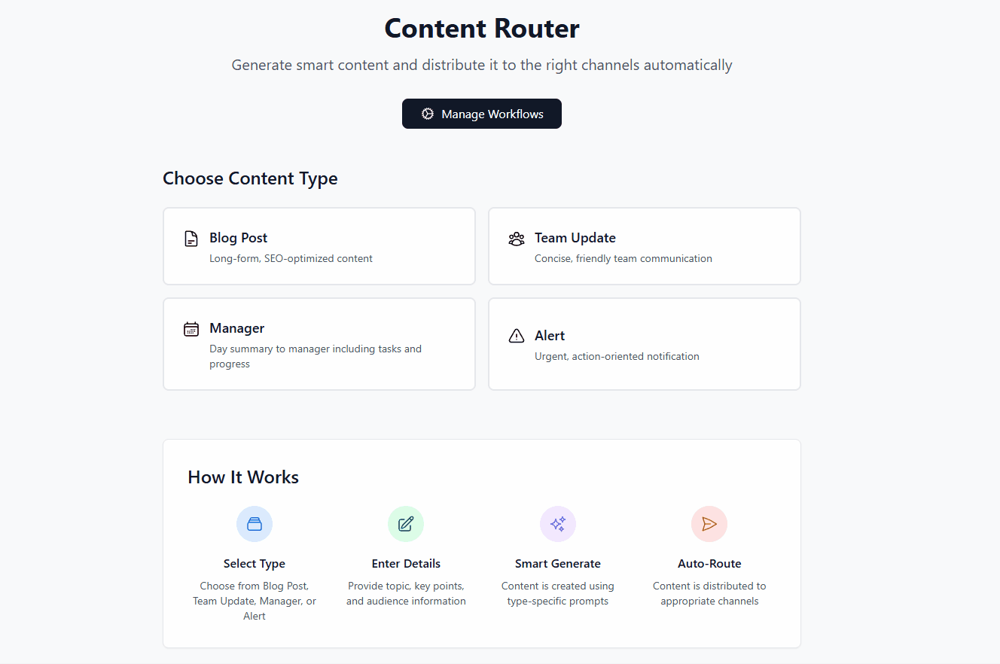
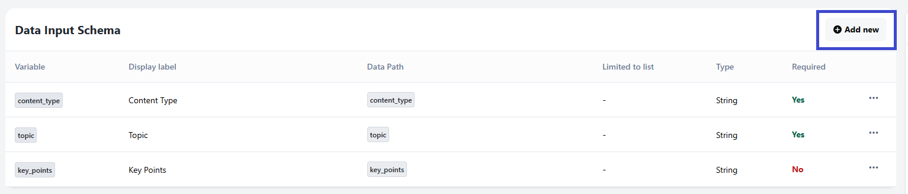
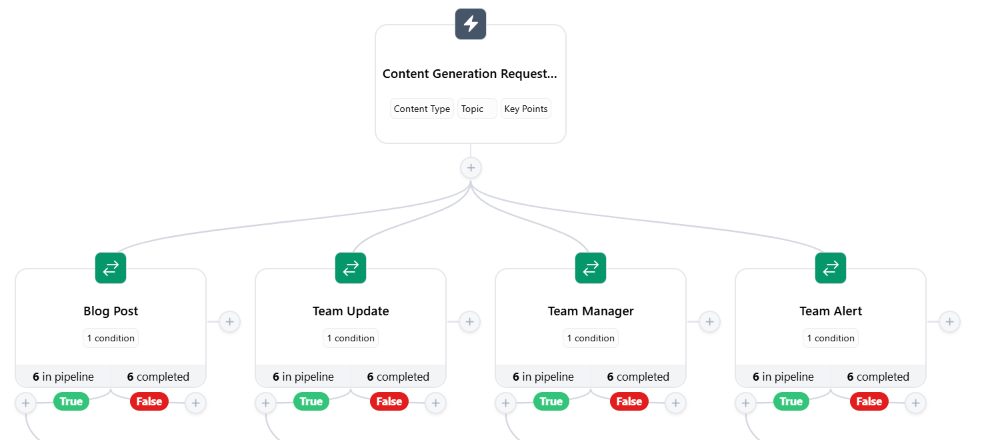
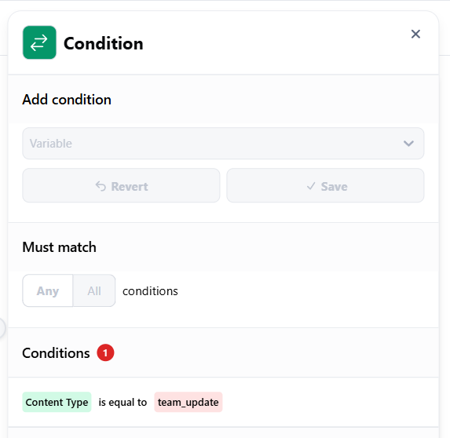
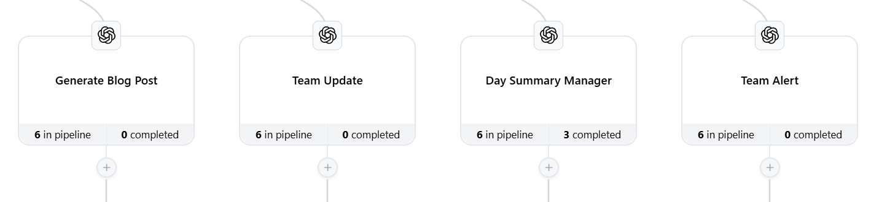
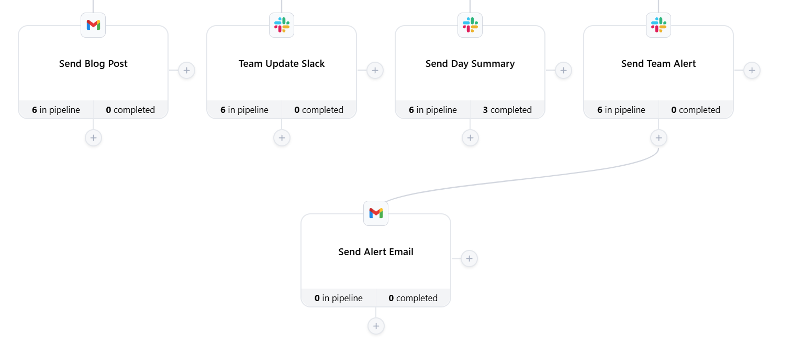

# AI Content Router - Smart Content Generation & Distribution

**Disclaimer**: Parts of this content have been generated with the use of AI.



**Intermediary Demo Level** - Advanced workflow concepts such as conditional logic, which gives artificial intelligence, and multi-channel routing are used.

This demo demonstrates Embed Workflow implementation for smart content creation and delivery. Create robust, type-aware workflows that automatically send your content to the right channels based on your business needs.

## Table of Contents

- [AI Content Router - Smart Content Generation \& Distribution](#ai-content-router---smart-content-generation--distribution)
  - [Table of Contents](#table-of-contents)
  - [🚀 Quick Start](#-quick-start)
    - [1. Navigate to Project Directory](#1-navigate-to-project-directory)
    - [2. Install Dependencies](#2-install-dependencies)
    - [3. Set Up Embed Workflow](#3-set-up-embed-workflow)
    - [4. Run the Development Server](#4-run-the-development-server)
    - [5. Verify Embedded Workflow Builder](#5-verify-embedded-workflow-builder)
    - [6. You're Ready to Build!](#6-youre-ready-to-build)
  - [Configure Your Workflows](#configure-your-workflows)
    - [1. Create a trigger](#1-create-a-trigger)
      - [Content Generation Trigger](#content-generation-trigger)
    - [2. Create Workflows](#2-create-workflows)
      - [1. Access the Workflow Builder](#1-access-the-workflow-builder)
      - [2. Create a New Workflow](#2-create-a-new-workflow)
      - [3. Set Up Content Type Routing with Conditions](#3-set-up-content-type-routing-with-conditions)
      - [4. Add Ask ChatGPT Actions to Each True Branch](#4-add-ask-chatgpt-actions-to-each-true-branch)
      - [5. Add Distribution Actions](#5-add-distribution-actions)
      - [6. Finalize and Activate](#6-finalize-and-activate)
  - [Using the Application](#using-the-application)
    - [Step-by-Step Testing](#step-by-step-testing)
  - [Implementation Notes](#implementation-notes)
  - [How it was implemented?](#how-it-was-implemented)
    - [Embedded Workflow Implementation](#embedded-workflow-implementation)
    - [Embed the Workflow Builder](#embed-the-workflow-builder)
    - [Implementation in Next.js](#implementation-in-nextjs)
    - [How Embedded Workflow Receives Variables](#how-embedded-workflow-receives-variables)

## 🚀 Quick Start

Follow these steps to see AI-powered content generation in action within minutes.

### 1. Navigate to Project Directory

```bash
cd intermediary/ai-content-router
# or on Windows
cd embed-workflow-demos\\intermediary\\ai-content-router
```

### 2. Install Dependencies

```bash
npm install
# or
yarn install
```

### 3. Set Up Embed Workflow

**Prerequisites:** You need an Embed Workflow account. [Sign up here](https://embedworkflow.com) if you don't have one.

Copy the `.env.template` to `.env.local` and add your keys:

```bash
cp .env.template .env.local
```

Then edit `.env.local` with your actual keys:

```bash
EMBED_WORKFLOW_SK=your_secret_key_here
EMBED_WORKFLOW_PK=your_publishable_key_here
NEXT_PUBLIC_EMBED_WORKFLOW_PK=your_publishable_key_here
EMBED_WORKFLOW_UI_VERSION=x.x.x
NEXT_PUBLIC_EMBED_WORKFLOW_UI_VERSION=x.x.x

# Optional: Set a default user for workflows (defaults to 'main')
# EMBED_WORKFLOW_DEFAULT_USER=main
```

**Note:** Check the latest UI version at https://embedworkflow.com/ui-version

**Get Your API Keys:**

1. Log into your [Embed Workflow account](https://embedworkflow.com/app)
2. Click the gear icon (⚙️) → API Keys  
3. Copy your Secret Key and Publishable Key
4. Update the `.env.local` file with your actual keys

For complete setup documentation, see: [Embed Workflow Quick Start Guide](https://docs.embedworkflow.com/getting-started/quick-start)

For API documentation, see: [Embed Workflow API Documentation](https://api-docs.embedworkflow.com/#api-overview)

### 4. Run the Development Server

```bash
npm run dev
# or
yarn dev
```

### 5. Verify Embedded Workflow Builder

1. **Open the Application**
   - Open [http://localhost:3000](http://localhost:3000) in your browser

2. **Access the Embedded Workflow Builder**
   - Click the **"Manage Workflows"** button
   - This opens the embedded workflow builder directly in your app
   - You should see the Embed Workflow interface loaded without any redirects

### 6. You're Ready to Build!

**It's here!** You've just added an AI-driven content creation platform to your application. No redirects, no external tooling - your users can now build sophisticated workflows and highly featured automations directly within your application.

**What's Next?** Open your triggers and define your first workflow.

## Configure Your Workflows

Now that we've reviewed the embedded builder, let's establish the AI content generation triggers and workflows.

### 1. Create a trigger


Go to your Embed Workflow dashboard, and click on Triggers tab and create this trigger:

**Steps to Create a Trigger:**

1. Go to your Embed Workflow dashboard
2. Click on the "Triggers" tab
3. Click "New Trigger"
4. Configure the fields using the YAML configuration below
5. Click **"Publish Changes"** to make your trigger active


#### Content Generation Trigger

```yaml
event: "content_generation_requested"
icon:
  type: "zap"
  background_color: "blue"
groups: []
data_input_schema:
  - type: "String"
    required: true
    variable: "content_type"
    data_path: "content_type"
    display_label: "Content Type"
  - type: "String"
    required: true
    variable: "topic"
    data_path: "topic"
    display_label: "Topic"
  - type: "String"
    required: false
    variable: "key_points"
    data_path: "key_points"
    display_label: "Key Points"
title: "Content Generation Requested"
description: "AI content generation and distribution requested"
```

### 2. Create Workflows

Build AI-powered workflows directly in your embedded application.

#### 1. Access the Workflow Builder

In your AI Content Router app, click **Manage Workflows**. This opens your embedded workflow builder.

#### 2. Create a New Workflow  
1. Click **New Workflow** in the embedded builder
2. Name it "Smart Content Router"
3. Select **Content Generation Requested** as your trigger
4. Click **Create**

#### 3. Set Up Content Type Routing with Conditions  



Create four separate condition branches to route content based on type. After the trigger, click the **+** sign and add conditions.

**Understanding Condition Operations:**

These operations are available when setting up conditions:
- `==` - Equals (exact match)
- `!=` - Not equals
- `includes` - Contains the specified value
- `excludes` - Does not contain the value
- `present` - Field exists and has a value
- `empty` - Field is empty or null
- `==` `{{}}` - Equals another variable
- `!=` `{{}}` - Not equals another variable

For multiple conditions in one action, choose:
- **All conditions must be true** (AND logic)
- **Any condition must be true** (OR logic)

Now create each condition:



**Blog Post Condition:**  
1. Click **+** → Select **Condition**
2. Name: "Blog Post"
3. Variable: Select `content_type`
4. Operation: Choose `==` (equals)
5. Value: Enter `blog_post`
6. Click **Save** on the Add condition section, then click **Save** on at the end of the condition tab

**Team Update Condition:**  
1. Click **+** → Select **Condition**
2. Name: "Team Update"
3. Variable: Select `content_type`
4. Operation: Choose `==` (equals)
5. Value: Enter `team_update`
6. Click **Save** on the Add condition section, then click **Save** on at the end of the condition tab

**Team Manager Condition:**  
1. Click **+** → Select **Condition**
2. Name: "Team Manager"
3. Variable: Select `content_type`
4. Operation: Choose `==` (equals)
5. Value: Enter `manager`
6. Click **Save** on the Add condition section, then click **Save** on at the end of the condition tab

**Team Alert Condition:**  
1. Click **+** → Select **Condition**
2. Name: "Team Alert"
3. Variable: Select `content_type`
4. Operation: Choose `==` (equals)
5. Value: Enter `alert`
6. Click **Save** on the Add condition section, then click **Save** on at the end of the condition tab

#### 4. Add Ask ChatGPT Actions to Each True Branch  

Before configuring the "Ask ChatGPT" actions, you need to create a connection to OpenAI.

**Create OpenAI Connection:**
1. In the "Ask ChatGPT" action, select "Create a new connection".
2. Fill in the following information:
   * **Connection name:** A descriptive name for your connection (e.g., "My OpenAI Key").
   * **API Key:** Your OpenAI API key.

**How to get your OpenAI API key:**
1. Log in to your [OpenAI dashboard](https://platform.openai.com).

**Pro Tip:** We strongly recommend upgrading to a paid OpenAI plan before using this integration. Free accounts frequently encounter rate limiting (429 errors) which can disrupt your workflows.

After creating the connection, the settings options will appear where you can configure:
- **Model:** Select which ChatGPT model to use (e.g., gpt-3.5-turbo, gpt-4)
- **Question:** Write your prompt or question for ChatGPT
- **Length:** Define the maximum length of the generated text (token limit)
- **Temperature:** Adjust the creativity/randomness of responses (0 = most focused, 2 = most creative)


Each condition's True branch needs its own ChatGPT action for customized content generation.

**For Blog Post (True Branch):**  
1. Click **+** under the True path
2. Select **Ask ChatGPT**
3. Configure:
   - Action Name: `Generate Blog Post`
   - Connection: Select your ChatGPT connection
   - Model: `gpt-4`
   - Max Length: `2000` tokens
   - Temperature: `0.7`
4. In the Prompt field, add:
   ```
   Write a blog post about "{{topic}}".
   
   Cover these points: {{key_points}}
   
   Use a professional, informative tone.
   ```
5. Click the red **+** to insert `{{topic}}` and `{{key_points}}`
6. Save

**For Team Update (True Branch):**  
1. Click **+** under the True path
2. Select **Ask ChatGPT**
3. Configure:
   - Action Name: `Team Update`
   - Model: `gpt-3.5-turbo`
   - Max Length: `500` tokens
   - Temperature: `0.8`
4. Add the team update prompt with variables:
   ```
   Write a team update about "{{topic}}".
   
   Include: {{key_points}}
   
   Use a friendly, encouraging tone.
   ```
5. Save

**For Team Manager (True Branch):**  
1. Click **+** under the True path
2. Select **Ask ChatGPT**
3. Configure:
   - Action Name: `Day Summary Manager`
   - Model: `gpt-4`
   - Max Length: `800` tokens
   - Temperature: `0.5`
4. Add the manager summary prompt with variables:
   ```
   Write a daily summary report about "{{topic}}".
   
   Include: {{key_points}}
   
   Use a professional, data-driven tone.
   ```
5. Save

**For Team Alert (True Branch):**  
1. Click **+** under the True path
2. Select **Ask ChatGPT**
3. Configure:
   - Action Name: `Team Alert`
   - Model: `gpt-3.5-turbo`
   - Max Length: `300` tokens
   - Temperature: `0.3`
4. Add the alert prompt with variables:
   ```
   Write an urgent alert about "{{topic}}".
   
   Key information: {{key_points}}
   
   Use a direct, action-oriented tone.
   ```
5. Save

#### 5. Add Distribution Actions  



After each Ask ChatGPT action, add distribution actions. The ChatGPT action creates special variables you can use:

**Special ChatGPT Variables Available:**
- `{{generated_text}}` - The AI-generated content
- `{{model_used}}` - Model used (gpt-4, gpt-3.5-turbo)
- `{{completion_id}}` - Unique ID for this generation
- `{{created_at}}` - The timestamp of when the generation was created
- `{{finish_reason}}` - Why generation stopped (stop, length)
- `{{prompt_tokens}}` - Tokens used in the prompt
- `{{completion_tokens}}` - Tokens used in the response
- `{{total_tokens}}` - Total tokens used

**Trigger Variables Also Available:**
- `{{content_type}}` - The content type from the trigger
- `{{topic}}` - The topic from trigger
- `{{key_points}}` - The key points from the trigger

**Blog Post → Email Distribution:**  
1. After "Generate Blog Post", click **+**
2. Select **Send Email**
3. Configure:
   - Action Name: `Send Blog Post`
   - To: `marketing@yourcompany.com`
   - Subject: `New Blog Post: {{topic}}`
4. Email Body - use the red **+** to add:
   ```
   Hello Marketing Team,

   A new blog post has been generated about {{topic}}.

   === GENERATED CONTENT ===
   
   {{generated_text}}
   
   === END CONTENT ===
   
   Review and publish as appropriate.
   ```
5. Save

**Team Update → Slack Distribution:**  
1. After "Team Update", click **+**
2. Select **Send Message**
3. Configure:
   - Action Name: `Team Update Slack`
   - Channel: `#general`
4. Message - use the red **+** to add:
   ```
   📢 *Team Update: {{topic}}*
   
   {{generated_text}}
   ```
5. Save

**Day Summary → Manager DM:**  
1. After "Day Summary Manager", click **+**
2. Select **Send Direct Message**
3. Configure:
   - Action Name: `Send Day Summary`
   - User: `@manager`
4. Add message with `{{generated_text}}`
5. Save

**Team Alert → Slack + Email (Two Actions):**  
1. After "Team Alert", click **+**
2. Add **Send Message** for Slack #urgent with @here
3. Click **+** again
4. Add **Send Email** with high priority
5. Configure both with `{{generated_text}}`

#### 6. Finalize and Activate  
1. Review your workflow
2. Toggle the workflow to **On** status
3. Click **Publish Changes** to save and activate

## Using the Application

### Step-by-Step Testing

1. **Open the Application**
   - Go back to [http://localhost:3000](http://localhost:3000)

2. **Choose Your Content Type**
   - **Blog Post**: For long-form, SEO-optimized content
   - **Team Update**: For internal team communication  
   - **Manager**: For task summaries and progress reports
   - **Alert**: For urgent, action-oriented notifications

3. **Fill in the Details**
   - **Topic**: Enter your main subject (e.g., "Product Launch Updates")
   - **Key Points**: List the main points to cover (one per line)

4. **Generate & Distribute**
   - Click the blue "Generate & Distribute" button
   - The system will:
     - Trigger your configured workflows
     - Use AI to create content based on your inputs
     - Format it appropriately for the content type
     - Automatically route it to your configured channels

5. **Check Results**
   - Check your configured channels (Slack, email, etc.) for the generated content
   - Review workflow execution in the "Manage Workflows" section

## Implementation Notes

- This project uses the OpenAI API for content generation. You will need a valid OpenAI API key.
- The core logic for this demo is the conditional routing of content based on the selected content type.
- The application uses Next.js API routes to trigger workflows and communicate with the Embed Workflow API.

## How it was implemented?

### Embedded Workflow Implementation

The embedded workflow builder is implemented in `/pages/workflows/index.js`. Here are the key code blocks:

### Embed the Workflow Builder

For complete documentation on embedding and authentication, see: [Embed Workflow Quick Start Guide](https://docs.embedworkflow.com/getting-started/quick-start)

First, add the following script tag to your HTML:

```html
<!-- Load CSS / JS -->
<!-- Check latest version at: https://embedworkflow.com/ui-version -->
<link rel="stylesheet" media="screen" href="https://cdn.ewf.to/ewf-your_ui_version_here.css">
<script src="https://cdn.ewf.to/ewf-your_ui_version_here.js"></script>

<!-- Mounted App -->
<div class="EWF__app" data-base-path="workflows"></div>

<script type="text/javascript">
  EWF.load("your_publishable_key_here", { jwt: "your_jwt_here" });
</script>
```

### Implementation in Next.js

In the actual Next.js implementation, the version is loaded dynamically from environment variables:

**1. Loading the Embed Workflow UI:**
```jsx
// Version comes from NEXT_PUBLIC_EMBED_WORKFLOW_UI_VERSION in .env.local
const version = process.env.NEXT_PUBLIC_EMBED_WORKFLOW_UI_VERSION || '1.5.0';

const script = document.createElement("script");
script.src = `https://cdn.ewf.to/ewf-${version}.js`;

script.onload = () => {
  loadWorkflows();
};
```

**2. Embedding Container:**
```jsx
<div
  className="EWF__app"
  data-base-path="workflows"
></div>
```

**3. Initialization:**
```jsx
const loadWorkflows = () => window.EWF.load(embedWorkflowPk, { 
  jwt: token
});
```

**4. JWT Token Generation:**
```jsx
const payload = {
  sub: id, // user's unique identifier
  iat: currentTime,
  exp: currentTime + 60 * 60,
  discover: true
};
const token = JWT.sign(payload, secret, { algorithm: "HS256" });
```

### How Embedded Workflow Receives Variables

When your application triggers a workflow, it sends data to Embed Workflow through API calls. Here's how the variables flow from your app to your workflows:

**1. Trigger API Call:**
Your application sends a POST request to trigger workflows:
```javascript
const response = await fetch('/api/generate-content', {
  method: 'POST',
  headers: { 'Content-Type': 'application/json' },
  body: JSON.stringify({
    event: 'content_generation_requested',
    data: {
      content_type: 'blog_post',
      topic: 'Getting started with Embed Workflow',
      key_points: 'Easy to use, powerful, and fully embedded.'
    }
  })
});
```

**2. Server-side Processing:**
The `/pages/api/generate-content.js` endpoint forwards this data to Embed Workflow:
```javascript
const payload = {
  event: eventName,
  execution_data: eventData,
  user_key: 'main'  // or the specific user key
};

const response = await fetch('https://embedworkflow.com/api/v1/trigger', {
  method: 'POST',
  headers: {
    'Authorization': `Bearer ${process.env.EMBED_WORKFLOW_SK}`,
    'Content-Type': 'application/json'
  },
  body: JSON.stringify(payload)
});
```

**3. Variable Mapping:**
Embed Workflow maps the incoming data to your trigger's schema:
- `data.content_type` → `{{content_type}}` variable
- `data.topic` → `{{topic}}` variable  
- `data.key_points` → `{{key_points}}` variable

**4. Using Variables in Actions:**
These variables become available in your workflow actions:
```
Write a blog post about "{{topic}}".

Cover these points: {{key_points}}
```