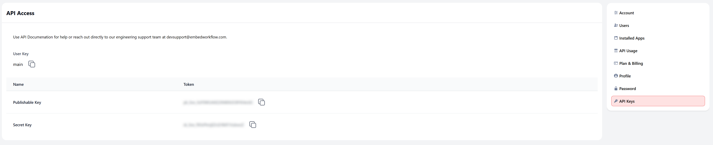

# AI Content Router - Smart Content Generation & Distribution

**Disclaimer**: Parts of this content have been generated with the use of AI.


**Intermediary Demo Level** - Learn conditional logic, AI integration, and multi-channel routing.

Generate AI-powered content and route it to the right channels. Build workflows that understand content types and deliver them where you need.

## Table of Contents

- [AI Content Router - Smart Content Generation \& Distribution](#ai-content-router---smart-content-generation--distribution)
  - [Table of Contents](#table-of-contents)
  - [🚀 Quick Start](#-quick-start)
    - [1. Navigate to Project Directory](#1-navigate-to-project-directory)
    - [2. Install Dependencies](#2-install-dependencies)
    - [3. Set Up Embed Workflow](#3-set-up-embed-workflow)
    - [4. Run the Development Server](#4-run-the-development-server)
    - [5. Experience Your Embedded Automation Platform](#5-experience-your-embedded-automation-platform)
    - [6. You're Ready to Build!](#6-youre-ready-to-build)
  - [Import Your Workflow](#import-your-workflow)
  - [Using the Application](#using-the-application)
    - [Step-by-Step Testing](#step-by-step-testing)
  - [Implementation Notes](#implementation-notes)
  - [How it was implemented?](#how-it-was-implemented)
    - [Embedded Workflow Implementation](#embedded-workflow-implementation)
    - [Embed the Workflow Builder](#embed-the-workflow-builder)
    - [Implementation in Next.js](#implementation-in-nextjs)
    - [How Embedded Workflow Receives Variables](#how-embedded-workflow-receives-variables)

## 🚀 Quick Start

Follow these steps to see the embedded workflow builder in your app within minutes.

### 1. Navigate to Project Directory

```bash
cd embed-workflow-demos/intermediary/ai-content-router
# or on Windows
cd embed-workflow-demos\intermediary\ai-content-router
```

### 2. Install Dependencies

```bash
npm install
# or
yarn install
```

### 3. Set Up Embed Workflow

**Prerequisites:** You need an Embed Workflow account. [Sign up here](https://embedworkflow.com) if you don't have one.

Copy the `.env.template` to `.env.local` and add your keys:

```bash
cp .env.template .env.local
```

Then edit `.env.local` with your actual keys:

```bash
EMBED_WORKFLOW_SK=your_secret_key_here
EMBED_WORKFLOW_PK=your_publishable_key_here
NEXT_PUBLIC_EMBED_WORKFLOW_PK=your_publishable_key_here
EMBED_WORKFLOW_UI_VERSION=x.x.x
NEXT_PUBLIC_EMBED_WORKFLOW_UI_VERSION=x.x.x

# Optional: Set a default user for workflows (defaults to 'main')
# EMBED_WORKFLOW_DEFAULT_USER=main
```

**Note:** Check the latest UI version at https://embedworkflow.com/ui-version

**Get Your API Keys:**



1. Log into your [Embed Workflow account](https://embedworkflow.com/app)
2. Click the gear icon (⚙️) → API Keys  
3. Copy your Secret Key and Publishable Key
4. Update the `.env.local` file with your actual keys

**User-Specific Workflows:** Each user has their own set of workflows and automations. The app uses `EMBED_WORKFLOW_DEFAULT_USER` (defaults to 'main') to determine which user's workflows to load. This is important because:

- Each user can have different workflows
- Tasks and automations are isolated per user

Change the user by setting `EMBED_WORKFLOW_DEFAULT_USER` in your `.env.local` file.

### 4. Run the Development Server

```bash
npm run dev
# or
yarn dev
```

### 5. Experience Your Embedded Automation Platform

1. Open [http://localhost:3000](http://localhost:3000)
2. Click the **"Manage Workflows"** button

### 6. You're Ready to Build!

🎉 **This is it!** You've successfully embedded a complete automation platform into your Todo app. No redirects, no external tools - your users can now create workflows and powerful automations without ever leaving your application.

**What's Next?** Simply import the workflow below to get started!

## Import Your Workflow

Import the workflow configuration to create your trigger, actions, and workflow structure. You must configure each action with your connections and settings after import:

**Task Notification Recipe:**

Copy the recipe below:

```yaml
# Content Generation Recipe
# AI-powered content generation and distribution based on content type

# Apps used for content generation and distribution
apps:
  - gmail
  - slack
  - openai

# Trigger for content generation requests
triggers:
  - title: "Content Generation Requested"
    description: "Triggered when content generation is requested"
    event: "content_generation_requested"
    icon:
      type: "sparkles"
      background_color: "purple"
    groups: []
    data_input_schema:
      - type: "String"
        required: true
        variable: "content_type"
        data_path: "content_type"
        display_label: "Content Type"
      - type: "String"
        required: true
        variable: "topic"
        data_path: "topic"
        display_label: "Topic"
      - type: "String"
        required: false
        variable: "key_points"
        data_path: "key_points"
        display_label: "Key Points"

# Workflow definition
workflows:
  - name: "AI Content Generation and Distribution"
    description: "Generates different types of content using AI and distributes through appropriate channels"
    categories:
      - Content Creation
    image_url: "https://cms.embedworkflow.com/wp-content/uploads/2025/07/20250726162345_content_generation_image.png"
    summary: |
      ## AI Content Generation Workflow

      This advanced workflow uses AI to generate different types of content and automatically distributes them through the appropriate channels based on content type.

      ### Conditional Branches:
      1. **Blog Post** → Generate with GPT-4 Turbo (800-1200 words) → Email to marketing team
      2. **Team Update** → Generate with GPT-4 Turbo (300 words) → Post to Slack #demo
      3. **Manager Summary** → Generate with GPT-4 (data-driven) → DM to manager
      4. **Alert** → Generate urgent alert → Slack #demo → Follow-up email

      ### Key Features:
      - Intelligent routing based on content type
      - Different AI models and parameters per content type
      - Multi-channel distribution
      - Temperature set to 0.2 for consistent output
      - Sequential notification for alerts (Slack then email)
    trigger:
      event: "content_generation_requested"
      match_conditions: "all"
      conditions: []

    # Complex conditional routing based on content type
    edges:
      - "33f939-883342"  # Blog post condition -> Generate blog
      - "883342-bc08bd"  # Generate blog -> Send email
      - "959df7-3fa8ea"  # Team update condition -> Generate update
      - "3fa8ea-85bc47"  # Generate update -> Post to Slack
      - "7a7541-4d82bf"  # Manager summary condition -> Generate summary
      - "4d82bf-aeca40"  # Generate summary -> Send DM
      - "9b59d2-c7fd2a"  # Alert condition -> Generate alert
      - "c7fd2a-611b02"  # Generate alert -> Post to Slack
      - "611b02-6c2c71"  # Post alert -> Send email

    nodes:
      # Blog Post Branch
      - id: "33f939"
        name: "Blog Post"
        type: "Condition"
        action_type_id: "{{ native.condition }}"
        match_conditions: "any"
        conditions:
          - type: "equal"
            field: "content_type"
            value: "blog_post"

      - id: "883342"
        name: "Generate Blog Post"
        type: "CustomApiRequest"
        action_type_id: "{{ apps.openai.ask_chatgpt }}"
        prefix: "generated_post_"
        required_condition_result: true
        action_data:
          form__openai_model:
            label: "gpt-4-turbo"
            value: "gpt-4-turbo"
          form__openai_question: |
            Question:

            Create a comprehensive, SEO-optimized blog post about "{{ topic }}".

            Key points to cover:
            {{ key_points }}

              Requirements:
              - Use engaging headlines and subheadings
              - Include actionable insights
              - Make it 800-1200 words
              - End with a clear call-to-action
              - Professional and informative tone
          form__openai_max_tokens: 1000
          form__openai_temperature: 0.2

      - id: "bc08bd"
        name: "Send Blog Post"
        type: "CustomApiRequest"
        action_type_id: "{{ apps.gmail.send_email }}"
        prefix: ""
        action_data:
          form__gmail_subject: "{{ topic }}"
          form__gmail_body: "{{ generated_post_generated_text }}"
          form__gmail_cc: ""
          form__gmail_bcc: ""

      # Team Update Branch
      - id: "959df7"
        name: "Team Update"
        type: "Condition"
        action_type_id: "{{ native.condition }}"
        match_conditions: "any"
        conditions:
          - type: "equal"
            field: "content_type"
            value: "team_update"

      - id: "3fa8ea"
        name: "Team Update"
        type: "CustomApiRequest"
        action_type_id: "{{ apps.openai.ask_chatgpt }}"
        prefix: "generated_update_"
        required_condition_result: true
        action_data:
          form__openai_model:
            label: "gpt-4-turbo"
            value: "gpt-4-turbo"
          form__openai_question: |
            Write a friendly, concise team update about "{{ topic }}".

            Key points to cover:
            {{ key_points }}

            Style requirements:
            - Keep it warm and encouraging
            - Use bullet points for clarity
            - Include any relevant metrics or achievements
            - End with next steps or upcoming priorities
            - Maximum 300 words
            - Casual but professional tone
          form__openai_max_tokens: 300
          form__openai_temperature: 0.2

      - id: "85bc47"
        name: "Team Update Slack"
        type: "CustomApiRequest"
        action_type_id: "{{ apps.slack.send_message }}"
        prefix: ""
        action_data:
          form__slack_message_text: "{{ generated_update_generated_text }}"
          form__slack_blocks: ""

      # Manager Summary Branch
      - id: "7a7541"
        name: "Team Manager"
        type: "Condition"
        action_type_id: "{{ native.condition }}"
        match_conditions: "any"
        conditions:
          - type: "equal"
            field: "content_type"
            value: "manager_summary"

      - id: "4d82bf"
        name: "Day Summary Manager"
        type: "CustomApiRequest"
        action_type_id: "{{ apps.openai.ask_chatgpt }}"
        prefix: "generated_summary_"
        required_condition_result: true
        action_data:
          form__openai_model:
            label: "gpt-4"
            value: "gpt-4"
          form__openai_question: |
            Write a daily summary report about "{{ topic }}".
            Include: {{ key_points }}
            Use a professional, data-driven tone.
          form__openai_max_tokens: 300
          form__openai_temperature: 0.2

      - id: "aeca40"
        name: "Send Day Summary"
        type: "CustomApiRequest"
        action_type_id: "{{ apps.slack.send_direct_message }}"
        prefix: ""
        action_data:
          form__slack_dm_text: "{{ generated_summary_generated_text }}"
          form__slack_dm_blocks: ""

      # Alert Branch
      - id: "9b59d2"
        name: "Team Alert"
        type: "Condition"
        action_type_id: "{{ native.condition }}"
        match_conditions: "any"
        conditions:
          - type: "equal"
            field: "content_type"
            value: "alert"

      - id: "c7fd2a"
        name: "Team Alert"
        type: "CustomApiRequest"
        action_type_id: "{{ apps.openai.ask_chatgpt }}"
        prefix: "generated_alert_"
        required_condition_result: true
        action_data:
          form__openai_model:
            label: "gpt-4-turbo"
            value: "gpt-4-turbo"
          form__openai_question: |
             Write an urgent alert about "{{ topic }}".
             Key information: {{ key_points }}
             Use a direct, action-oriented tone.
          form__openai_max_tokens: 200
          form__openai_temperature: 0.2

      - id: "611b02"
        name: "Send Team Alert"
        type: "CustomApiRequest"
        action_type_id: "{{ apps.slack.send_message }}"
        prefix: ""
        action_data:
          form__slack_message_text: "{{ generated_alert_generated_text }}"
          form__slack_blocks: ""

      - id: "6c2c71"
        name: "Send Alert Email"
        type: "CustomApiRequest"
        action_type_id: "{{ apps.gmail.send_email }}"
        prefix: ""
        action_data:
          form__gmail_subject: "{{ topic }}"
          form__gmail_body: |
               Hello Marketing Team,

               A new blog post has been generated about {{ topic }}.

               === GENERATED CONTENT ===

               {{ generated_alert_generated_text }}

               === END CONTENT ===

               Review and publish as appropriate.
          form__gmail_cc: ""
          form__gmail_bcc: ""
```

**Import Steps:**


1. **Access Configuration Settings**  
   Click the gear icon (⚙️) in your workflow dashboard

2. **Open Import Configuration**  
   Click **Import Configuration** from the settings menu

3. **Import Workflow**  
   Paste the YAML configuration above → Click **Import**
   
   > **Note:** If you receive an "app already installed" error, remove the `apps:` section from the YAML (lines with `- gmail` and `- slack`). This error occurs when these apps exist in your account. Check this by clicking the gear icon (⚙️) → **Installed Apps**.

4. **Verify Import**  
   Navigate to the **Workflows** tab to see your imported workflow

   

   > **Important:** The import creates your workflow structure. You'll need to configure connections and activate the workflow to make it functional.

5. **Configure Your Service Connections**
   
   Update the imported workflow actions with your actual service connections:

   **Slack Connection:**
   - Click any Slack action in your workflow
   - Add your Slack Bot Token (get from [Slack API](https://api.slack.com/apps))

   **Gmail Connection:**
   - Click the Gmail action
   - Follow the OAuth flow to connect your email account

   **OpenAI Connection:**
   - Click the "Ask ChatGPT" action
   - Select **Create a new connection**
   - Fill in these fields:
     - **Connection name:** A descriptive name (e.g., "My OpenAI Key")
     - **API Key:** Your OpenAI API key
   
   **Getting Your OpenAI API Key:**
   1. Log in to your [OpenAI dashboard](https://platform.openai.com)
   2. Navigate to **API Keys** section
   3. Create a new secret key
   4. Copy and paste it into the connection form


   For detailed connection setup instructions, check the [Embed Workflow Documentation](https://docs.embedworkflow.com/)

6. **Activate Workflow**  
   Toggle "On" → Click **Publish Changes**

   


## Using the Application

### Step-by-Step Testing

1. **Open the Application**
   - Go back to [http://localhost:3000](http://localhost:3000)

2. **Choose Your Content Type**
   - **Blog Post**: For long-form, SEO-optimized content
   - **Team Update**: For internal team communication  
   - **Manager**: For task summaries and progress reports
   - **Alert**: For urgent, action-oriented notifications

3. **Fill in the Details**
   - **Topic**: Enter your main subject (e.g., "Product Launch Updates")
   - **Key Points**: List the main points to cover (one per line)

4. **Generate & Distribute**
   - Click the blue "Generate & Distribute" button
   - The system will:
     - Trigger your configured workflows
     - Use AI to create content based on your inputs
     - Format it appropriately for the content type
     - Automatically route it to your configured channels

5. **Check Results**
   - Check your configured channels (Slack, email, etc.) for the generated content
   - Review workflow execution in the "Manage Workflows" section

## Implementation Notes

- This project uses the OpenAI API for content generation. You will need a valid OpenAI API key.
- The core logic for this demo is the conditional routing of content based on the selected content type.
- The application uses Next.js API routes to trigger workflows and communicate with the Embed Workflow API.

## How it was implemented?

### Embedded Workflow Implementation

The embedded workflow builder is implemented in `/pages/workflows/index.js`. Here are the key code blocks:

### Embed the Workflow Builder

For complete documentation on embedding and authentication, see: [Embed Workflow Quick Start Guide](https://docs.embedworkflow.com/getting-started/quick-start)

First, add the following script tag to your HTML:

```html
<!-- Load CSS / JS -->
<!-- Check latest version at: https://embedworkflow.com/ui-version -->
<link rel="stylesheet" media="screen" href="https://cdn.ewf.to/ewf-your_ui_version_here.css">
<script src="https://cdn.ewf.to/ewf-your_ui_version_here.js"></script>

<!-- Mounted App -->
<div class="EWF__app" data-base-path="workflows"></div>

<script type="text/javascript">
  EWF.load("your_publishable_key_here", { jwt: "your_jwt_here" });
</script>
```

### Implementation in Next.js

In the actual Next.js implementation, the version is loaded dynamically from environment variables:

**1. Loading the Embed Workflow UI:**
```jsx
// Version comes from NEXT_PUBLIC_EMBED_WORKFLOW_UI_VERSION in .env.local
const version = process.env.NEXT_PUBLIC_EMBED_WORKFLOW_UI_VERSION || '1.5.0';

const script = document.createElement("script");
script.src = `https://cdn.ewf.to/ewf-${version}.js`;

script.onload = () => {
  loadWorkflows();
};
```

**2. Embedding Container:**
```jsx
<div
  className="EWF__app"
  data-base-path="workflows"
></div>
```

**3. Initialization:**
```jsx
const loadWorkflows = () => window.EWF.load(embedWorkflowPk, { 
  jwt: token
});
```

**4. JWT Token Generation:**
```jsx
const payload = {
  sub: id, // user's unique identifier
  iat: currentTime,
  exp: currentTime + 60 * 60,
  discover: true
};
const token = JWT.sign(payload, secret, { algorithm: "HS256" });
```

### How Embedded Workflow Receives Variables

When your application triggers a workflow, it sends data to Embed Workflow through API calls. Here's how the variables flow from your app to your workflows:

**1. Trigger API Call:**
Your application sends a POST request to trigger workflows:
```javascript
const response = await fetch('/api/generate-content', {
  method: 'POST',
  headers: { 'Content-Type': 'application/json' },
  body: JSON.stringify({
    event: 'content_generation_requested',
    data: {
      content_type: 'blog_post',
      topic: 'Getting started with Embed Workflow',
      key_points: 'Easy to use, powerful, and fully embedded.'
    }
  })
});
```

**2. Server-side Processing:**
The `/pages/api/generate-content.js` endpoint forwards this data to Embed Workflow:
```javascript
const payload = {
  event: eventName,
  execution_data: eventData,
  user_key: 'main'  // or the specific user key
};

const response = await fetch('https://embedworkflow.com/api/v1/trigger', {
  method: 'POST',
  headers: {
    'Authorization': `Bearer ${process.env.EMBED_WORKFLOW_SK}`,
    'Content-Type': 'application/json'
  },
  body: JSON.stringify(payload)
});
```

**3. Variable Mapping:**
Embed Workflow maps the incoming data to your trigger's schema:
- `data.content_type` → `{{content_type}}` variable
- `data.topic` → `{{topic}}` variable  
- `data.key_points` → `{{key_points}}` variable

**4. Using Variables in Actions:**
These variables become available in your workflow actions:
```
Write a blog post about "{{topic}}".

Cover these points: {{key_points}}
```